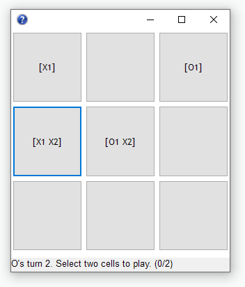

# Quantum Tic-Tac-Toe

### Please note
This is still extremely buggy. I would try to fix some of the bugs but the issue is this game is really tough to wrap your head around and I barely understand what I'm doing or what's supposed to happen when playing the game.

### Instructions
https://en.wikipedia.org/wiki/Quantum_tic-tac-toe#Gameplay

### Download
You can get a compiled binary for Windows from the [releases page](https://github.com/dkter/quantum_tic_tac_toe/releases/latest) (download quantumttt.exe).

#### For developers
To import the code into your own Dolphin Smalltalk image:

- Clone this repo
- In Dolphin Smalltalk, go to the Package Browser
- Click "Install Package" in the toolbar
- Navigate to the .pac file that's part of this repo, and install it
- When making changes, make sure to save the package (from the Package Browser, right-click the quantum_tic_tac_toe package and save it)
- When updating the package (i.e. after fetching new changes), you need to uninstall the package by right-clicking on it in the Package Browser, and then reinstall it.
